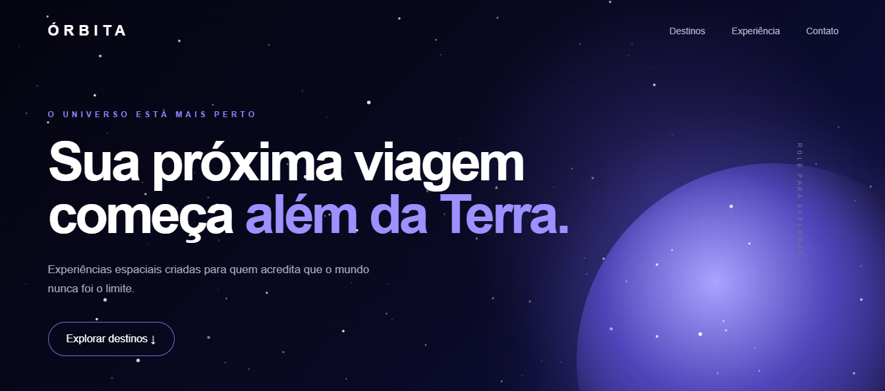

# 🚀 Órbita — Viagens Além da Terra

Órbita é uma experiência digital conceitual de turismo espacial desenvolvida com HTML, CSS e JavaScript.

O projeto simula uma plataforma de viagens espaciais, apresentando destinos como Lua, Marte e Europa, com uma interface imersiva, animações e um sistema fictício de reserva.

## 🖼️ Preview



## 🌐 Projeto online

Acesse o projeto publicado:

https://jefersonalvesrs.github.io/orbita/

## ✨ Funcionalidades

- Apresentação interativa dos destinos espaciais
- Cards para Lua, Marte e Europa
- Navegação entre as seções da página
- Animações e elementos visuais interativos
- Formulário de reserva interestelar
- Seleção de destino
- Confirmação visual da reserva
- Layout responsivo para desktop, tablet e celular
- Interface adaptada para diferentes tamanhos de tela
- Janelas interativas com informações detalhadas sobre cada destino

## 🛠️ Tecnologias utilizadas

- HTML5
- CSS3
- JavaScript
- Git
- GitHub
- GitHub Pages

## 📱 Responsividade

O projeto foi desenvolvido para se adaptar a diferentes tamanhos de tela, incluindo:

- Desktop
- Tablet
- Smartphones

Foram utilizados breakpoints e ajustes específicos de layout para manter a experiência visual e a usabilidade em diferentes dispositivos.

## 💡 O que pratiquei neste projeto

Durante o desenvolvimento do Órbita, trabalhei principalmente com:

- Estruturação semântica utilizando HTML
- Criação de layouts com CSS
- Responsividade e Media Queries
- Manipulação do DOM com JavaScript
- Eventos e interações do usuário
- Formulários
- Animações e transições
- Organização de código em arquivos separados
- Versionamento utilizando Git
- Publicação utilizando GitHub Pages

## 📂 Estrutura do projeto

```text
orbita/
├── assets/
│   └── images/
│       └── orbita-preview.png
├── index.html
├── style.css
├── script.js
└── README.md